声明：此贴为社团内部专用，如有异议，不骂人就行。

操劳对象：有意愿无时间琢磨的死忠粉——理性消费的小微氪玩家。

笔者价绍：新手一枚，菜鸟一只。

**1、认识首页**

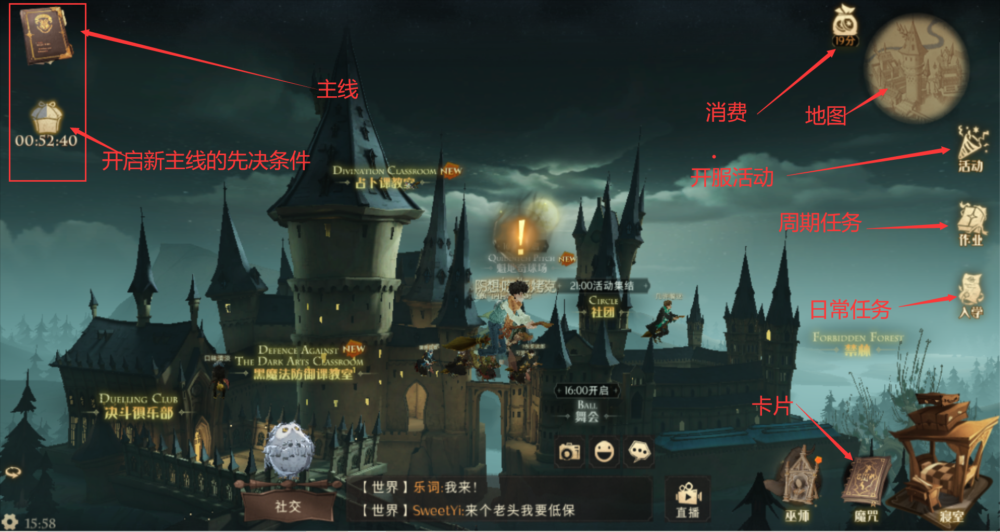

**2、立马说重头：氪金**

&#8195;&#8195;氪金只有一个原则，理性，即尊重小微氪的接受范围和没时间肝的时间。包括**礼包消费**、**周期消费(作业)里的礼盒**。

**2.1、礼包消费和钻石**

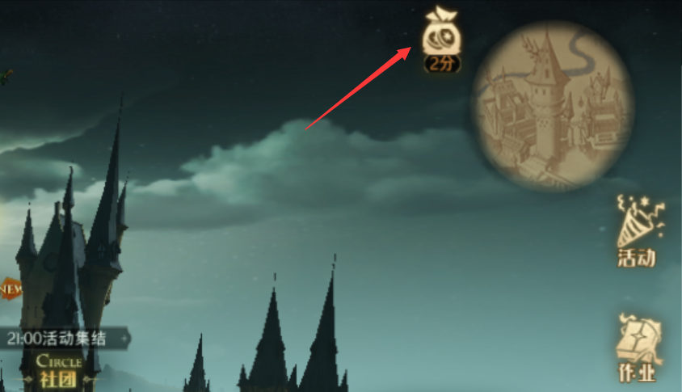

**2.1.1、买钻石和限时礼包**

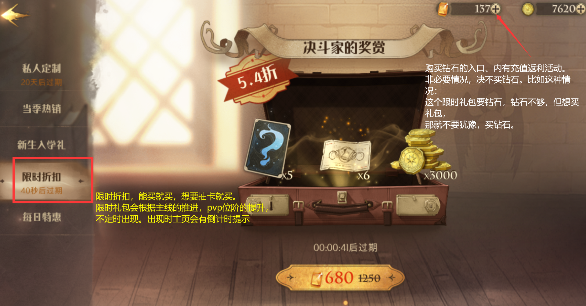

**2.1.2、私人定制**

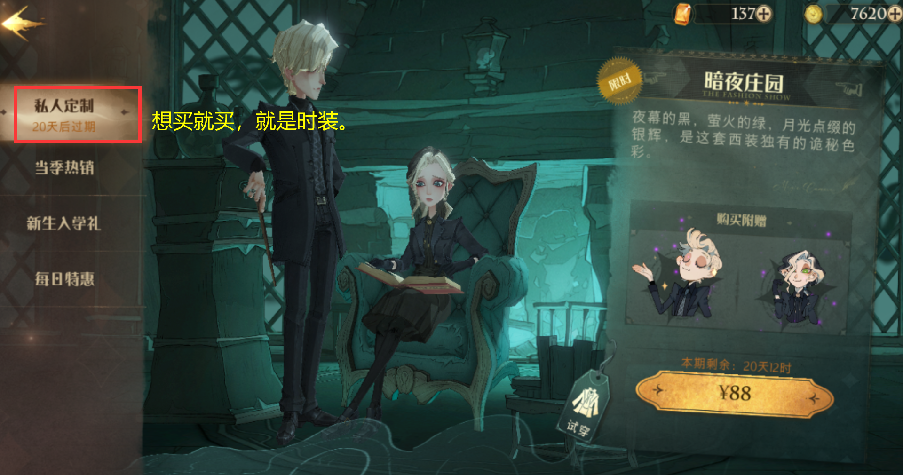

**2.1.3、当季热销**

&#8195;&#8195;主要说转盘，也就是幸运转盘，大奖是`pve`有属性加成的时装，**强烈不建议**去玩，即使肯花钱（听说拉满要上千），也没时间肝，也就是不能真正享受到加成。避免越氪越肝、越肝越氪的怪圈。

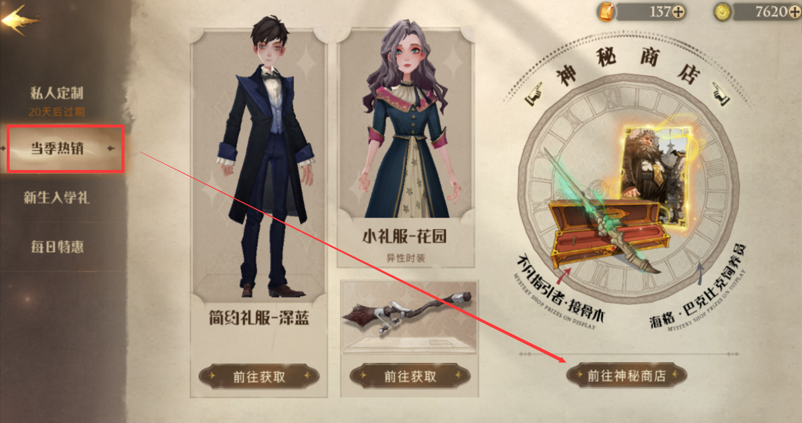

**2.1.4、新生入学礼**

&#8195;&#8195;必买，没什么商量的

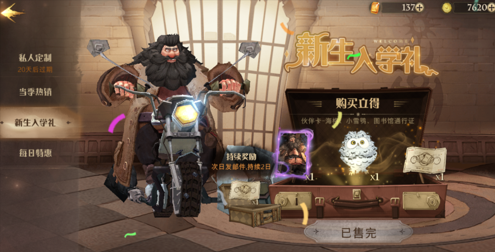

**2.1.5、每日特惠**

3.5折的买七天，持续买，没毛病；
4.6折的自由买，看心情；
6折的自由买，看心情，不推荐；
5折的自由买，看心情

为什么说自由买，因为我不敢说必须拉满，因为全部拉满的话一个月少说也上千了，与小微氪概念也许有点模糊了。

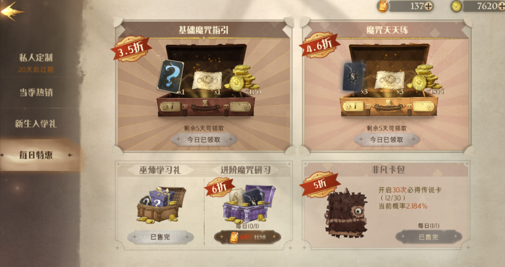

**2.2、作业的礼盒**

&#8195;&#8195;必须买，没商量。注：如果想直升10级，就买大礼盒。因为礼盒要靠作业任务来提升等级，达到等级了就能领礼盒。作业每日有5个还是几个任务，算下来一个周期内做任务是能拿完奖励的。任务也不算麻烦，即使做不完，后面也可以直接**购买等级。**

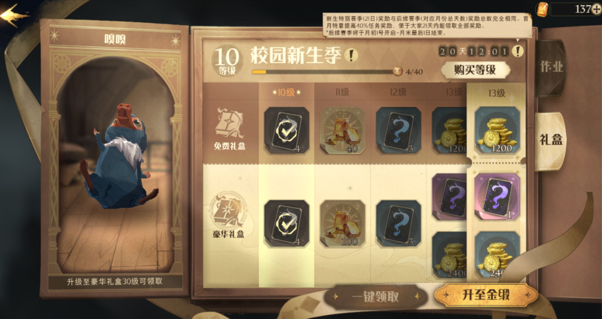

**3、主线**

&#8195;&#8195;游戏没打主线是没有灵魂的，即使主线可能不怎么样（我竟然不是新故事的绝对主角）。

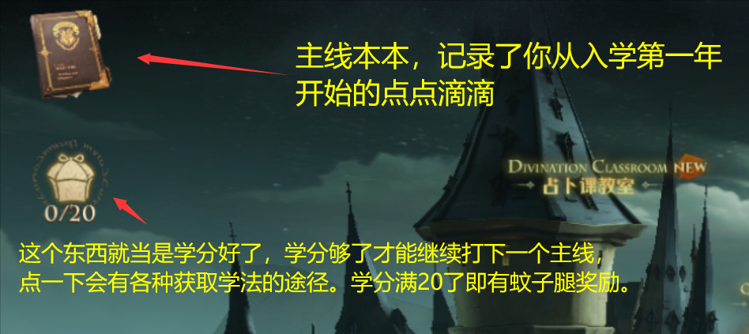

**3.1、主线本本**

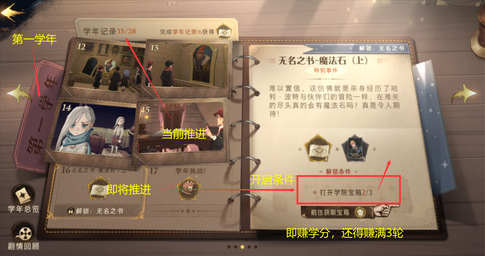

**3.2、学分（学院宝箱）**

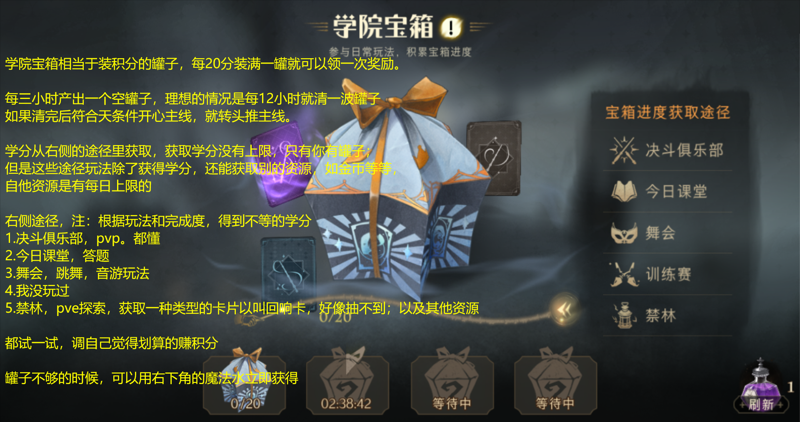

**4、开服活动**

**4.1、复制成双**

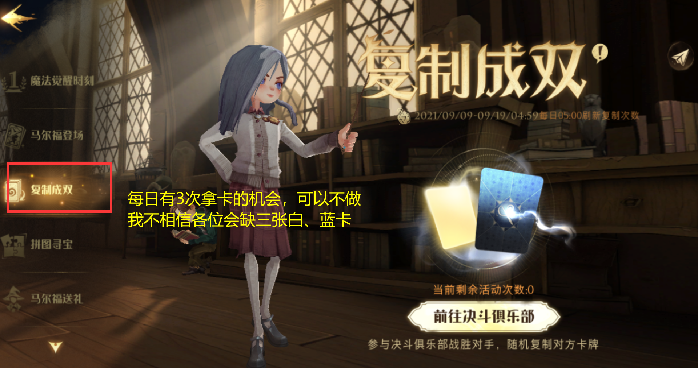

**4.2、拼图寻宝**

&#8195;&#8195;这种活动每天做一下，奖励应该不会差。附上b站大佬攻略视频，持续更新中：https://www.bilibili.com/video/BV1mg411F79t?spm_id_from=333.999.0.0

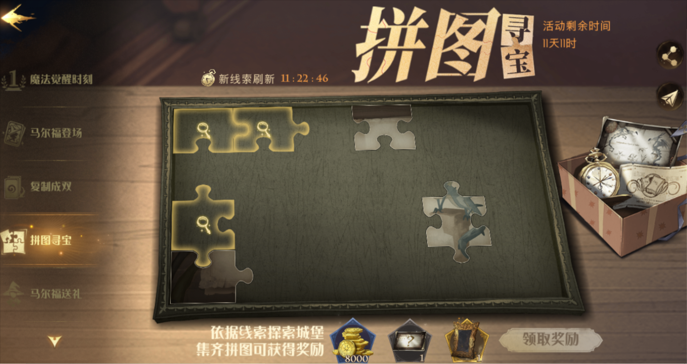

**4.3、**马尔福送礼口令：“除你武器”

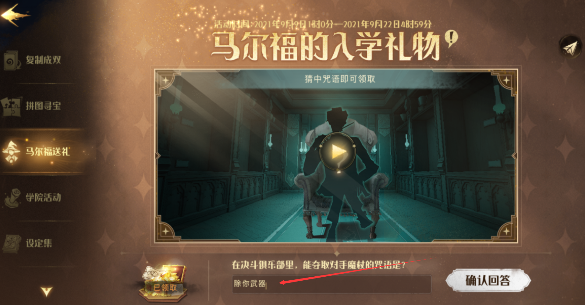

**其他活动不再赘述**

**5、入学——日常任务**

&#8195;&#8195;日常必须做，这个没商量，玩养成不做日常、不做主线，跟咸鱼没有区别。注：容易完成

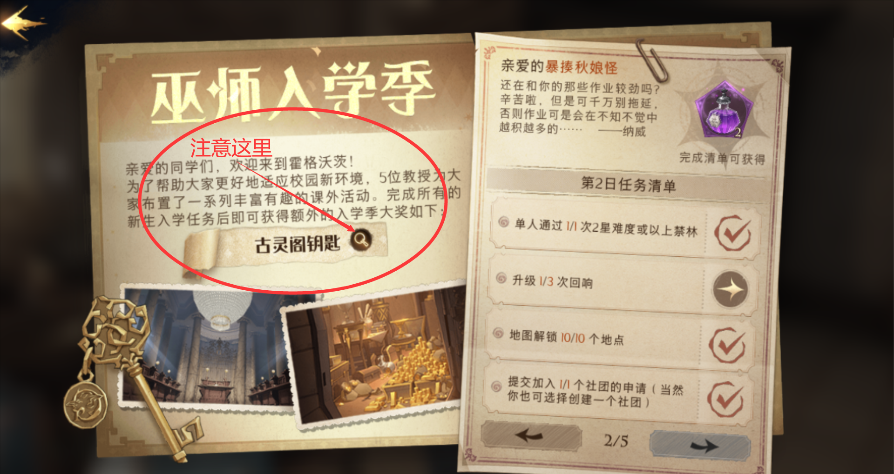

**6、工会活动**

&#8195;&#8195;站在团体的角度来看，工会活动是唯一应该准时参与的活动，不仅活跃社团的氛围，还有不错的奖励哟，其中奖励的徽章可以换金卡、紫卡登资源。

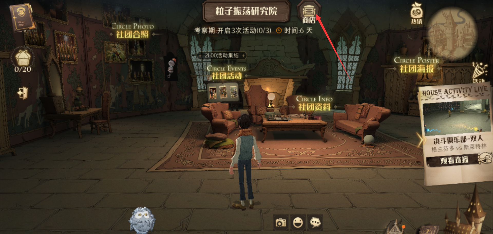

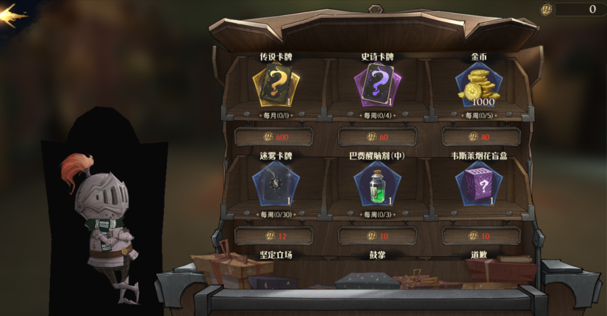

**7、游戏核心：卡片、卡组。**

&#8195;&#8195;本帖省略，以后我会将大佬的链接放在这里。补充：没有废卡，白卡、蓝卡、紫卡都能用（不绝对的说法，我相信没有任何一个游戏团队能做到绝对平衡）

**8、总结**

&#8195;&#8195;这游戏是一个披着大IP的强PVP的游戏，如果只是单纯的PVE，那么可能无法体验到本该体验的快乐，所以我在上面第6点把卡片卡组叫游戏核心，并且不敢有任何见解。所以建议各位，没空时做点日常攒点资源，得空时还是要打PVP，不为什么，就只快乐。